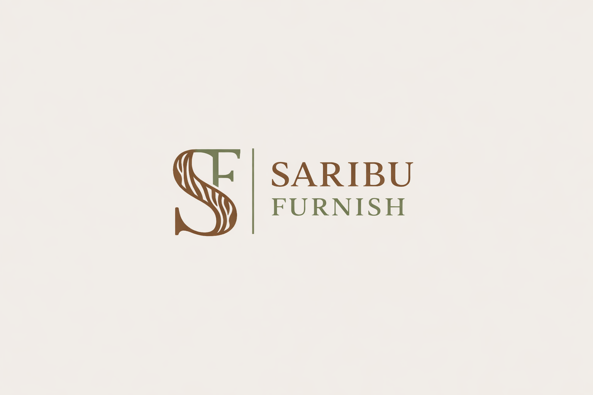
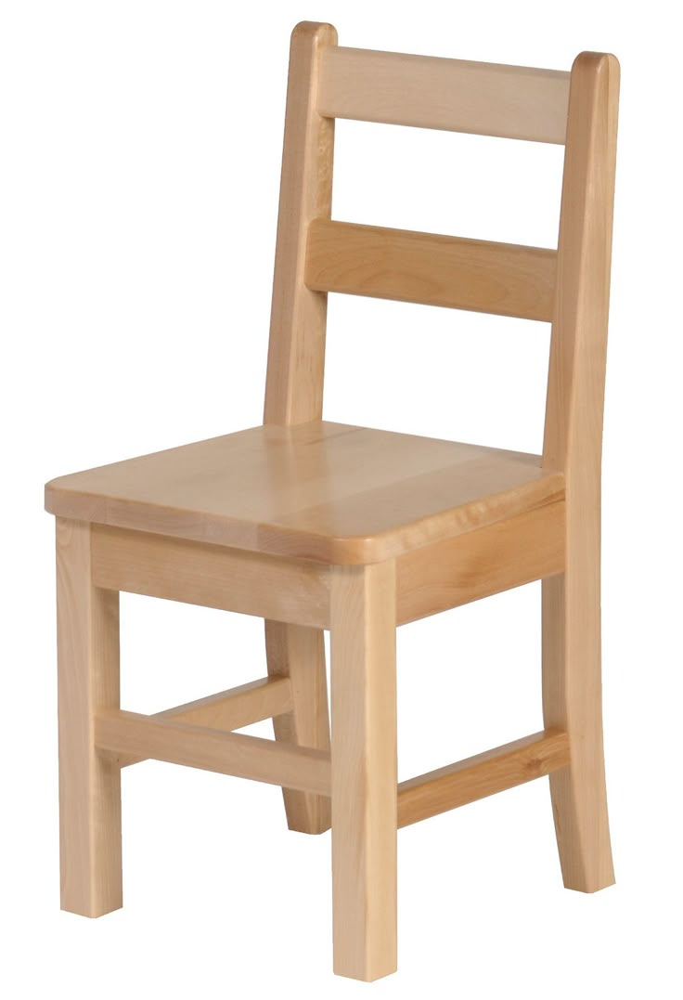
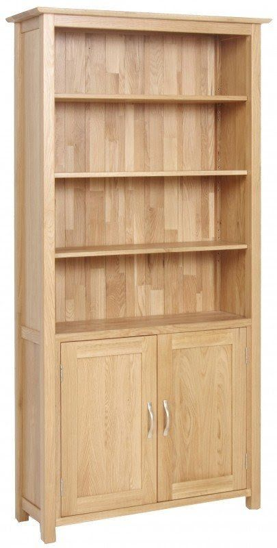
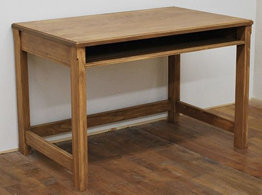
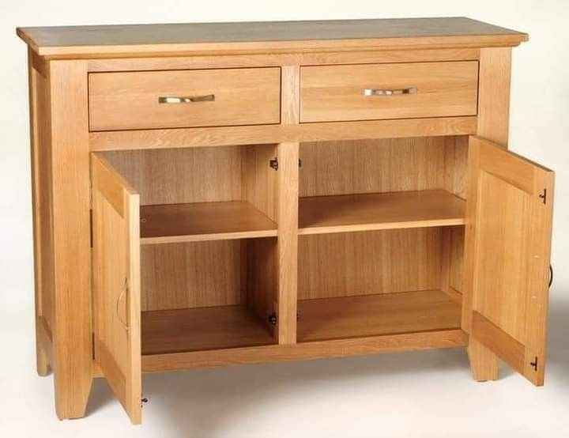
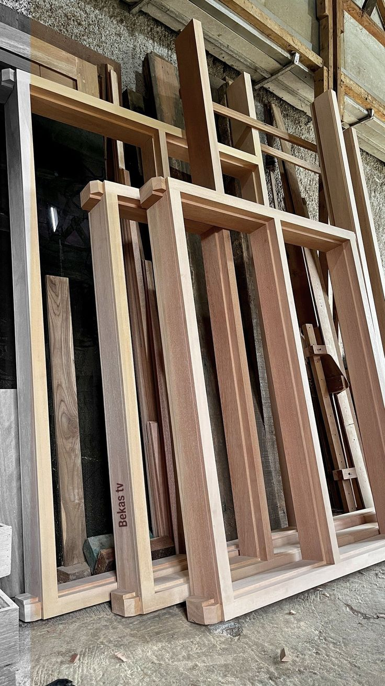
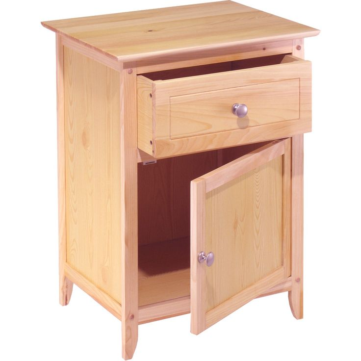

<!DOCTYPE html>
<html lang="id">
<head>
    <meta charset="UTF-8">
    <meta name="viewport" content="width=device-width, initial-scale=1.0">
    <title>Saribu Furnish - Furniture Kayu Handmade</title>

    <link rel="stylesheet" href="css/style.css">
</head>

<body>

<header id="home">

    

        
        Saribu Furnish
    

    <nav>
        <a href="#home">Home</a>
        <a href="#about">Tentang</a>
        <a href="#products">Produk</a>
        <a href="#gallery">Galeri</a>
        <a href="#contact">Kontak</a>
    </nav>

</header>

<section class="hero">

    <h1>Selamat Datang di Saribu Furnish</h1>

    

        Saribu Furnish menyediakan berbagai furniture kayu handmade dengan desain 
        natural, kuat, dan elegan. Setiap produk dibuat dengan kualitas terbaik 
        untuk memenuhi kebutuhan rumah Anda.
    

    <a href="#products" class="btn">Lihat Produk</a>

</section>

<section class="about" id="about">

    <h2>Tentang Saribu Furnish</h2>

    

        Saribu Furnish merupakan usaha mebel yang memproduksi berbagai furniture 
        berbahan kayu berkualitas seperti kursi, meja, lemari, dan berbagai produk 
        custom sesuai kebutuhan pelanggan. Setiap produk dibuat secara handmade 
        dengan memperhatikan kualitas, kekuatan, dan keindahan desain.
    

</section>

<section class="products" id="products">

    <h2>Produk Kami</h2>

    

        

            
            <h3>Kursi Kayu</h3>
            
Kursi kayu minimalis yang kuat, nyaman, dan cocok untuk berbagai ruang.

        

         

            
            <h3>Lemari Kayu</h3>
            
Lemari kayu handmade dengan desain natural dan kapasitas besar.

        

        
        

            
            <h3>Meja Makan</h3>
            
Meja makan dari kayu solid dengan desain elegan dan tahan lama.

        
     

    

</section>

<section class="gallery" id="gallery">

    <h2>Galeri Furniture</h2>

    

        
        
        
        
        
        

    

</section>

<section class="contact" id="contact">

    <h2>Hubungi Kami</h2>

    <form>

        <input type="text" placeholder="Nama Anda" required>

        <input type="email" placeholder="Email Anda" required>

        <textarea placeholder="Pesan Anda"></textarea>

        <button type="submit">Kirim Pesan</button>

    </form>

</section>

<footer>

    
© 2026 Saribu Furnish | Tiurida Pasaribu

    
231011060051

</footer>

</body>
</html>

body{
margin:0;
font-family:Arial, sans-serif;
line-height:1.6;
background:#f5f1ea;
padding-top:70px;
}

/* HEADER */

header {
background:#6b4f3b;
color:white;
display:flex;
justify-content:space-between;
align-items:center;
padding:10px 40px;

position:fixed;
top:0;
left:0;
right:0;
z-index:1000;

box-shadow:0 2px 10px rgba(0,0,0,0.1);
}

.logo{
display:flex;
align-items:center;
gap:12px;
font-size:22px;
font-weight:bold;
}

.logo-img{
height:45px;
width:auto;
display:block;
}

html{
scroll-behavior:smooth;
}

nav a{
color:white;
text-decoration:none;
margin-left:20px;
font-weight:bold;
}

nav a:hover{
text-decoration:underline;
}

/* HERO */

.hero{
height:60vh;

background:
linear-gradient(rgba(0,0,0,0.4),rgba(0,0,0,0.4)),
url("../images/workshop.jpg");

background-size:cover;
background-position:center;

color:white;

display:flex;
flex-direction:column;
justify-content:center;
align-items:center;
text-align:center;

padding:20px;
}

.hero h1{
font-size:40px;
margin-bottom:10px;
}

.hero p{
max-width:600px;
}

.btn{
margin-top:20px;
padding:12px 25px;
background:#8b5e3c;
color:white;
text-decoration:none;
border-radius:5px;
}

.btn:hover{
background:#6b4f3b;
}

/* ABOUT */

.about{
padding:60px 20px;
text-align:center;
max-width:800px;
margin:auto;
}

/* PRODUCTS */

.products{
padding:60px 20px;
text-align:center;
background:white;
}

.product-container{
display:flex;
justify-content:center;
gap:30px;
margin-top:30px;
flex-wrap:wrap;
}

.card{
background:#8b5e3c;
color:white;
padding:25px;
border-radius:10px;
width:220px;
box-shadow:0 4px 10px rgba(0,0,0,0.1);
transition:0.3s;
display:flex;
flex-direction:column;
}

.card:hover{
transform:translateY(-5px);
}

.card img{
width:100%;
height:300px;
object-fit:cover;
border-radius:6px;
margin-bottom:10px;
}

/* GALERI */

.gallery{
padding:60px 20px;
text-align:center;
}

.gallery-container{
display:flex;
justify-content:center;
flex-wrap:wrap;
gap:20px;
margin-top:30px;
}

.gallery-container img{
width:250px;
height:250px;
object-fit:cover;
border-radius:10px;
transition:transform 0.3s ease;
}

.gallery-container img:hover{
transform:scale(1.05);
}

/* CONTACT */

.contact{
padding:60px 20px;
text-align:center;
background:white;
}

form{
display:flex;
flex-direction:column;
width:320px;
margin:auto;
gap:10px;
}

input, textarea{
padding:10px;
border:1px solid #ccc;
border-radius:5px;
}

button{
background:#8b5e3c;
color:white;
border:none;
padding:10px;
border-radius:5px;
cursor:pointer;
}

button:hover{
background:#6b4f3b;
}

/* FOOTER */

footer{
background:#333;
color:white;
text-align:center;
padding:15px;
}

/* RESPONSIVE */

@media (max-width:768px){

header{
flex-direction:column;
text-align:center;
}

nav{
margin-top:10px;
}

.product-container{
flex-direction:column;
align-items:center;
}

.gallery-container{
flex-direction:column;
align-items:center;
}

.hero h1{
font-size:28px;
}

form{
width:90%;
}

}

